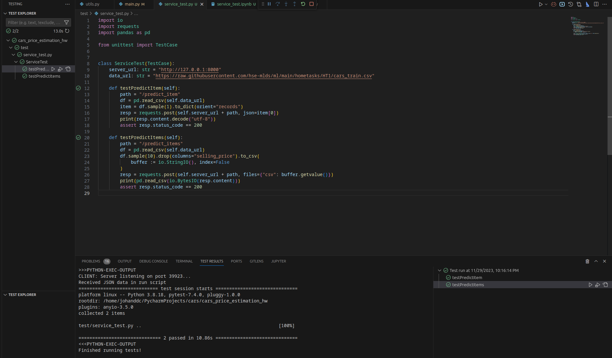
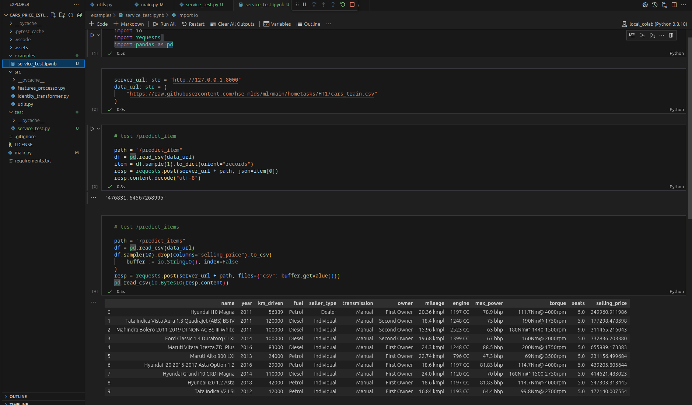

# Cars price estimation

This repository contains implementation of my ML course homework. The task was to implement web service using FastAPI. The service work in two modes: 

1. Single object prediction: user sends POST request to `/predict_item` which contains JSON with car description. Server returns a response with estimated price.
2. Multiple objects prediction: user sends POST request to `/predict_items` which contains CSV sheet with cars descriptions. Server returns the same CSV file with additional column corresponds to cars prices.

## Project structure

* The root of the project contains `main.py` file which is is responsible for starting the service and defining its behavior. Also the main notebook file with 
model training, EDA and visualizations is located in root.
* `src` directory contains Python scripts for features processing and extraction.
* `assets` directory contains two files namely
  * `car_makes.pickle` contains Python set with extracted train cars brands;
  * `model.pickle` contains model weights and feature transformers data;
  * `screenshots` directory with screenshots demonstration service work.
* `test` directory contains unit tests for web service.
* `examples` directory contains notebook with demonstration of service work.

## What was done

Note, that this section contains very brief description of my work. The detailed explanation may be found in notebook file.

* Split the Torque column into two columns. Experiments showed that this did not improve the model significantly;  
* Remarkably cleaned the dataset by removing outliers: all features were examined and some of the most distant objects were removed;
* Proposed several new features based on existing ones, such as the `old` feature which indicates whether the car was purchased before 2001 year;
* Converted some numerical features into categorical, such as the `engine` and `max_power` features, which were divided into several categories based on price ranges;
* Instead of predicting the raw price, proposed predicting the decimal logarithm of the price to avoid large absolute values in the model weights. (All previous steps added up to a 4% to R2 metrics);
* Added a brand feature based on the car name, which significantly improved the quality of the model up to 12% of R2 metrics;

The final R2 value on test data is `0.786`. The final value of business_metrics is `0.348`.

## What wasn't done

* I didn't have time to try different interactions between multiple features.. I wanted to try different combinations of fuel type and transmission type. Additionally, some numerical features could have been further categorized to explore combinations of categories. 
* It would have been possible to try more parameter combinations for the ElasticNet model. In the problem formulation with predicting the logarithm of price, adding L1 regularization term might have helped.

## Proof of work

Screenshot of passed unit tests.

Screenshot of testing code with server responses.
